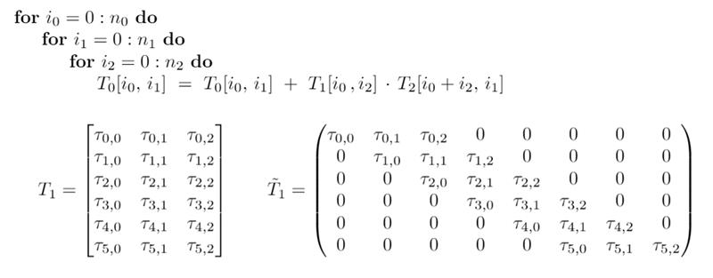

# Banded Matrix Multiplication in CUDA
Create a function that implements matrix multiplication between a banded matrix and a dense matrix.

Matrix multiplication is often shown as `T0 += T1 * T2`, where T0, T1 and T2 are dense matrices. This is almost identical, except that the A matrix in this case, is a banded matrix.

This can be described as follows:



* n0 is the number of rows in T0 and T1
* n1 is the number of columns in T0 and T2
* n2 is the inner or shared dimension, i.e. number of columns in T1 and number of rows in T2

The matrix T1 is a banded matrix, a type of sparse matrix. It’s often given the form T1 on the left to save space in RAM, but logically represents Ť1 on the right.

(See [Band matrix - Wikipedia]() if you want more info. Banded matrices have interesting mathematical properties that make them very useful in special situations. But we won’t get into that here).

## Requirements

### Create a program that implements the following:

Matrix multiplication between a banded matrix and a dense matrix. The only size to consider is when T0 is 1024 rows by 1024 columns (i.e. n0 == n1 == 1024.).

### Measure your performance:

Run your function until 10 sec has passed, then count the number of iterations.

Print your performance in FLOPS, calculated by:

FLOPS = NumberOfIterations x NumberOfOps / ElapsedTimeInSec

Let’s assume the dense theorical number of ops, which would make NumberOfOps = 1024 x 1024 x 1024 x 2.
Use 32-bit floating point data types for the input and output matrices.

In mathematics, particularly matrix theory, a band matrix or banded matrix is a sparse matrix whose non-zero entries are confined to a diagonal band, comprising the main diagonal and zero or more diagonals.

# Results

GPU: NVIDIA A6000

Configuration:
* PREFETCH: OFF
* DEVICE_INIT: ON

```shell
sh run.sh 

Using device 0
Values match
Blocksize: 16, Iterations: 516, FLOPS: 1.10508e+11, GFLOPS: 110.508
Blocksize: 32, Iterations: 412, FLOPS: 8.82523e+10, GFLOPS: 88.2523
Blocksize: 48, Iterations: 1420, FLOPS: 3.04572e+11, GFLOPS: 304.572
Blocksize: 64, Iterations: 1423, FLOPS: 3.05554e+11, GFLOPS: 305.554
Blocksize: 80, Iterations: 1424, FLOPS: 3.05765e+11, GFLOPS: 305.765
Blocksize: 96, Iterations: 1424, FLOPS: 3.05467e+11, GFLOPS: 305.467
Blocksize: 112, Iterations: 1424, FLOPS: 3.05467e+11, GFLOPS: 305.467
Blocksize: 128, Iterations: 1425, FLOPS: 3.0563e+11, GFLOPS: 305.63
Blocksize: 144, Iterations: 1425, FLOPS: 3.05938e+11, GFLOPS: 305.938
Blocksize: 160, Iterations: 1426, FLOPS: 3.05817e+11, GFLOPS: 305.817
Blocksize: 176, Iterations: 1426, FLOPS: 3.05888e+11, GFLOPS: 305.888
Blocksize: 192, Iterations: 1424, FLOPS: 3.05597e+11, GFLOPS: 305.597
Blocksize: 208, Iterations: 1425, FLOPS: 3.05773e+11, GFLOPS: 305.773
Blocksize: 224, Iterations: 1423, FLOPS: 3.05466e+11, GFLOPS: 305.466
Blocksize: 240, Iterations: 1423, FLOPS: 3.05492e+11, GFLOPS: 305.492
Blocksize: 256, Iterations: 1423, FLOPS: 3.05489e+11, GFLOPS: 305.489
Blocksize: 272, Iterations: 1423, FLOPS: 3.05412e+11, GFLOPS: 305.412
Blocksize: 288, Iterations: 1422, FLOPS: 3.05197e+11, GFLOPS: 305.197
Blocksize: 304, Iterations: 1425, FLOPS: 3.0576e+11, GFLOPS: 305.76
Blocksize: 320, Iterations: 1423, FLOPS: 3.05246e+11, GFLOPS: 305.246
Blocksize: 336, Iterations: 1425, FLOPS: 3.05946e+11, GFLOPS: 305.946
Blocksize: 352, Iterations: 1424, FLOPS: 3.05657e+11, GFLOPS: 305.657
Blocksize: 368, Iterations: 1425, FLOPS: 3.05818e+11, GFLOPS: 305.818
Blocksize: 384, Iterations: 1426, FLOPS: 3.05946e+11, GFLOPS: 305.946
Blocksize: 400, Iterations: 1426, FLOPS: 3.06023e+11, GFLOPS: 306.023
Blocksize: 416, Iterations: 1427, FLOPS: 3.06109e+11, GFLOPS: 306.109
Blocksize: 432, Iterations: 1426, FLOPS: 3.06134e+11, GFLOPS: 306.134
Blocksize: 448, Iterations: 1427, FLOPS: 3.06099e+11, GFLOPS: 306.099
Blocksize: 464, Iterations: 1426, FLOPS: 3.06201e+11, GFLOPS: 306.201
Blocksize: 480, Iterations: 1426, FLOPS: 3.0599e+11, GFLOPS: 305.99
Blocksize: 496, Iterations: 1426, FLOPS: 3.06155e+11, GFLOPS: 306.155
Blocksize: 512, Iterations: 1427, FLOPS: 3.06021e+11, GFLOPS: 306.021
Blocksize: 528, Iterations: 1425, FLOPS: 3.05609e+11, GFLOPS: 305.609
Blocksize: 544, Iterations: 1425, FLOPS: 3.05818e+11, GFLOPS: 305.818
Blocksize: 560, Iterations: 1425, FLOPS: 3.05758e+11, GFLOPS: 305.758
Blocksize: 576, Iterations: 1422, FLOPS: 3.04987e+11, GFLOPS: 304.987
Blocksize: 592, Iterations: 1422, FLOPS: 3.05124e+11, GFLOPS: 305.124
Blocksize: 608, Iterations: 1423, FLOPS: 3.05404e+11, GFLOPS: 305.404
Blocksize: 624, Iterations: 1422, FLOPS: 3.05348e+11, GFLOPS: 305.348
Blocksize: 640, Iterations: 1425, FLOPS: 3.05749e+11, GFLOPS: 305.749
Blocksize: 656, Iterations: 1423, FLOPS: 3.0533e+11, GFLOPS: 305.33
Blocksize: 672, Iterations: 1423, FLOPS: 3.05281e+11, GFLOPS: 305.281
Blocksize: 688, Iterations: 1421, FLOPS: 3.04992e+11, GFLOPS: 304.992
Blocksize: 704, Iterations: 1423, FLOPS: 3.05424e+11, GFLOPS: 305.424
Blocksize: 720, Iterations: 1422, FLOPS: 3.05136e+11, GFLOPS: 305.136
Blocksize: 736, Iterations: 1424, FLOPS: 3.05382e+11, GFLOPS: 305.382
Blocksize: 752, Iterations: 1422, FLOPS: 3.0522e+11, GFLOPS: 305.22
Blocksize: 768, Iterations: 1424, FLOPS: 3.05399e+11, GFLOPS: 305.399
Blocksize: 784, Iterations: 1423, FLOPS: 3.05324e+11, GFLOPS: 305.324
Blocksize: 800, Iterations: 1424, FLOPS: 3.05518e+11, GFLOPS: 305.518
Blocksize: 816, Iterations: 1424, FLOPS: 3.05627e+11, GFLOPS: 305.627
Blocksize: 832, Iterations: 1424, FLOPS: 3.0556e+11, GFLOPS: 305.56
Blocksize: 848, Iterations: 1423, FLOPS: 3.05497e+11, GFLOPS: 305.497
Blocksize: 864, Iterations: 1421, FLOPS: 3.05154e+11, GFLOPS: 305.154
Blocksize: 880, Iterations: 1423, FLOPS: 3.05165e+11, GFLOPS: 305.165
Blocksize: 896, Iterations: 1421, FLOPS: 3.05069e+11, GFLOPS: 305.069
Blocksize: 912, Iterations: 1421, FLOPS: 3.05151e+11, GFLOPS: 305.151
Blocksize: 928, Iterations: 1423, FLOPS: 3.05293e+11, GFLOPS: 305.293
Blocksize: 944, Iterations: 1423, FLOPS: 3.05405e+11, GFLOPS: 305.405
Blocksize: 960, Iterations: 1422, FLOPS: 3.04968e+11, GFLOPS: 304.968
Blocksize: 976, Iterations: 1423, FLOPS: 3.05533e+11, GFLOPS: 305.533
Blocksize: 992, Iterations: 1423, FLOPS: 3.05205e+11, GFLOPS: 305.205
Blocksize: 1008, Iterations: 1424, FLOPS: 3.05515e+11, GFLOPS: 305.515
Blocksize: 1024, Iterations: 1424, FLOPS: 3.05512e+11, GFLOPS: 305.512
```

# Profiling

## Install nsys
Download link (login required): https://developer.nvidia.com/gameworksdownload#?dn=nsight-systems-2023-2

```shell
sudo apt install libglib2.0-0
sudo dpkg -i NsightSystems-linux-cli-public-2023.2.1.122-3259852.deb
```

## Run nsys

```shell
nsys profile --stats=true ./bmm
```